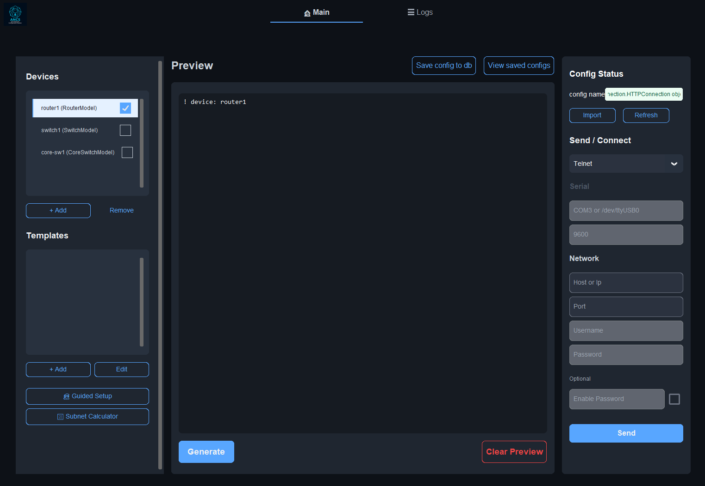

# Network Manager - ANCS

**Auto Network Configuration System**

A modern desktop application for network device configuration management with GNS3 integration.



## ✨ Features

- **Device Management** - Create and manage router, switch, and core switch configurations
- **Template System** - Create reusable configuration templates
- **GNS3 Integration** - Auto-import devices from GNS3 projects
- **Network Communication** - Send configurations via Serial, Telnet, or SSH
- **Configuration Wizards** - GUI wizards for VLAN and STP setup
- **Subnet Calculator** - Calculate and plan network subnets
- **Config Database** - SQLite storage for device and configuration persistence
- **Modern Dark UI** - Clean, responsive interface built with CustomTkinter

## 🚀 Installation

1. Clone the repository:
```bash
git clone https://github.com/zyada7med2/ANCS.git
cd ANCS/network_manager
```

2. Install dependencies:
```bash
pip install -r requirements.txt
```

3. Run the application:
```bash
python main.py
```

## 📦 Building Executable

To create a standalone executable using cx_Freeze:

```bash
python setup_build.py build
```

The executable will be in the `build/exe.win-amd64-3.x/` directory.

## 🏗️ Project Structure

```
network_manager/
├── main.py                 # Entry point
├── config.py               # Configuration constants
├── models/
│   └── devices.py          # Device models (Router, Switch, CoreSwitch)
├── network/
│   ├── sender.py           # Network communication (Serial, Telnet, SSH)
│   └── gns3.py             # GNS3 API connector
├── gui/
│   ├── app.py              # Main application window
│   ├── wizards/            # VLAN & STP configuration wizards
│   ├── calculators/        # Subnet calculator
│   └── dialogs/            # Popup dialogs
└── requirements.txt
```

## 📋 Requirements

- Python 3.7+
- customtkinter
- paramiko (SSH)
- pyserial (Serial)
- requests (GNS3 API)

## 📄 License

MIT License

