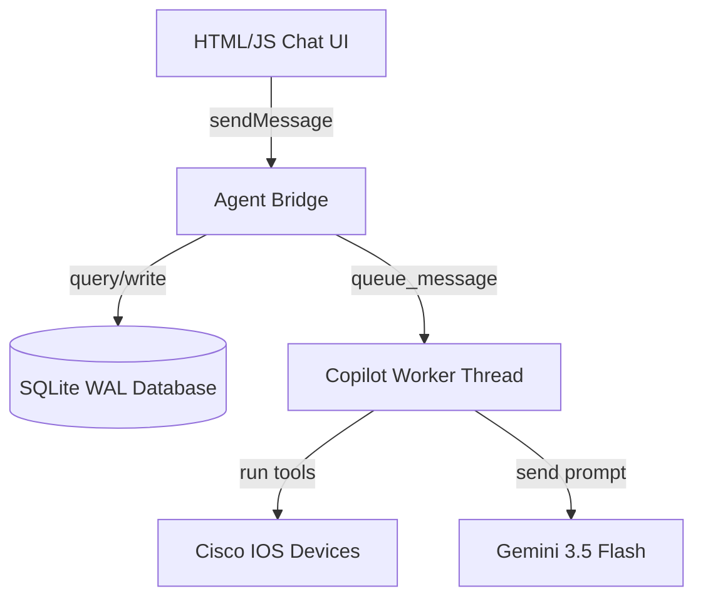

# Design Specification: ANCS Agent Enhancements (History, Mentions, Modes)

**Date**: 2026-05-27
**Status**: APPROVED

---

## 1. Overview & Context

This design outlines three main enhancements to the ANCS PySide6/QWebEngineView Hybrid AI Copilot:
1. **Past Conversations**: Save chat sessions to SQLite, expose management in the Settings modal, and enable continuing past conversations.
2. **@ Device Mentions**: Interactive autocomplete dropdown in the input text area. Python extracts mentions and injects full device configurations into the prompt context.
3. **Multi-Mode Support**: Ask Agent (Default), Auto Approved (bypass confirmation dialogs), and Planning Mode (enforce step-by-step plans using Claude XML prompt styling).

---

## 2. Component Design & Architecture



### 2.1. SQLite Database Schema (`config.py`)
Two new database tables are created. All operations use the global `db_lock` and operate in WAL mode:

* **`chat_conversations`**:
  Stores conversation metadata.
  - `conversation_id` (TEXT UNIQUE PRIMARY KEY)
  - `title` (TEXT)
  - `created_at` (TEXT DEFAULT CURRENT_TIMESTAMP)

* **`chat_messages`**:
  Stores individual messages.
  - `id` (INTEGER PRIMARY KEY AUTOINCREMENT)
  - `conversation_id` (TEXT FOREIGN KEY)
  - `sender` (TEXT CHECK(sender IN ('user', 'agent', 'system')))
  - `text` (TEXT)
  - `thoughts` (TEXT) - JSON-serialized list of thinking steps
  - `created_at` (TEXT DEFAULT CURRENT_TIMESTAMP)

An index is placed on `chat_messages(conversation_id)` for fast retrieval.

### 2.2. Autocomplete `@` Mentions (`index.html` & `agent_bridge.py`)
* **Autocomplete UI**: A floating list styled with glassmorphism is displayed above the input box when the cursor is in the `#chat-text-input` and the last typed word starts with `@`.
* **Devices List**: On UI initialization, the JS calls `window.bridge.getDevicesList()` to obtain a list of device hostnames and their types/roles.
* **Icons**: Devices are listed with corresponding SVG icons (router icon for `router` and switch icon for `switch`/`core switch`).
* **Context Injection**: When a message is sent, `AgentBridge.sendMessage` extracts `@name` tags, queries the database for each matching device's configuration and properties, and wraps it in XML blocks injected at the top of the message payload sent to `CopilotWorker`.

### 2.3. Multi-Mode Controls & Claude Prompt Styling
We replace the send options with:
1. **Ask Agent (Default)**: Always prompt user with the `DeployReviewDialog` confirmation before push.
2. **Auto Approved**: Skips confirmation, allowing the agent to deploy changes instantly.
3. **Planning Mode**: Forces the agent to output step-by-step plans.

#### Auto-Switching Intent
The JS text area listener scans for "auto approve" intent:
```javascript
const regex = /\bauto\s*approve\b|\bapprove\s*automatically\b/i;
if (regex.test(text)) {
    selectSendMode('auto_approve');
    showToast("Switched to Auto Approved Mode");
}
```

#### Skipping Approval (`ai_agent.py`)
If `self.mode == "auto_approve"`, `generate_and_deploy_device_config` bypasses the modal dialog entirely:
```python
if getattr(ctx, 'auto_approve', False):
    approved = True
    final_commands = commands
else:
    approved, final_commands = request_deploy_approval(hostname, device_role, commands)
```

#### Planning Mode XML Framing
To implement planning mode following structured Claude-like constraints (avoiding leaks, clear tags, recency sandwich), we inject this block in `_build_system_reminder()` only when `self.mode == "planning"`:
```xml
<planning-mode-directives>
YOU MUST FOLLOW THESE PLANNING INSTRUCTIONS:
1. Since you are in PLANNING MODE, you are forbidden from invoking any configuration or deployment tools on this turn.
2. You must think step-by-step and write out a detailed, structured implementation plan in your response.
3. Your plan must list:
   - Involved devices
   - Commands to be executed
   - Order of operations
   - Risks and verification checks
4. End your response by asking the user to review the plan and confirm execution.
</planning-mode-directives>
```

### 2.4. Settings UI Tabs Integration (`index.html`)
* A new tab `<div class="settings-nav-item" id="settings-nav-history" onclick="switchSettingsTab('history')">` is added.
* Selecting it renders a scrollable list of conversations.
* Clicking "Load" triggers:
  ```javascript
  window.bridge.loadConversation(id);
  toggleSettingsModal();
  switchTab('chat');
  ```
* Clicking "Delete" triggers `window.bridge.deleteConversation(id)` and updates the settings page list.

---

## 3. Testing & Verification

1. **DB Initialization**: Verify table creation on startup.
2. **Chat History Persistence**: Verify user messages and AI responses are successfully stored and retrieved.
3. **Mention Context**: Validate that mentioning `@R1` correctly queries `R1`'s config and injects it into python's message payload.
4. **Planning Mode**: Verify the LLM outputs a plan and does not execute tools on the first turn in Planning Mode.
5. **Auto-Approve Bypass**: Verify that deployment occurs instantly without modal popup in Auto Approved Mode.
