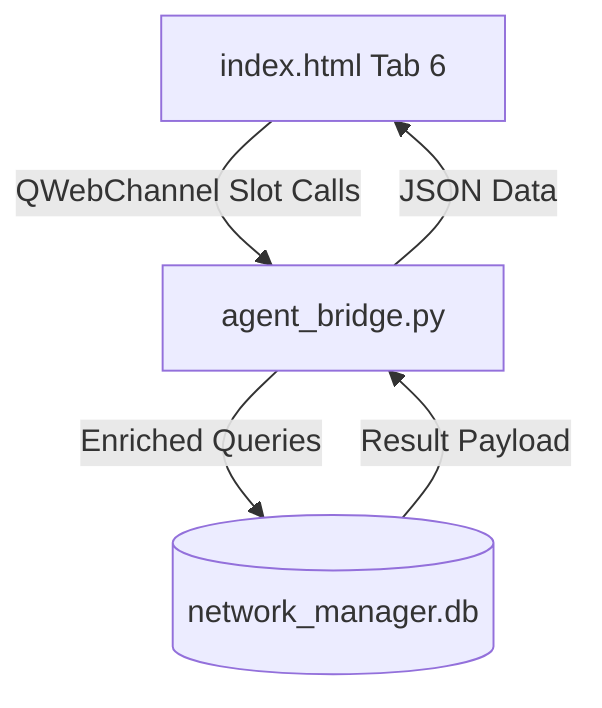

# Design Specification: Chat History UI/UX Upgrade

**Date**: 2026-05-27
**Status**: APPROVED

---

## 1. Overview & Goals
The objective is to overhaul the ANCS Copilot's **Chat History** settings tab into a highly aesthetic, interactive, and friendly workspace. 
Instead of a simple database table listing raw titles, we are implementing:
1. **Glassmorphic Card Grid**: Compact, modern glass cards containing message counts, clean date badges, and clickable device pill tags (e.g. `@R1`, `@SW1`).
2. **Real-time Filter & Search**: A search box filtering sessions by title, model type, or mentioned device tags instantly.
3. **Slide-in Preview Drawer**: A split-screen pane that slides out within the settings dialog to render a non-destructive scrollable preview of the conversation's messages and thinking steps.
4. **Inline Rename**: Fast title editing directly on the cards, avoiding nested modals or page reloads.
5. **Bulk Action Support**: Integration with existing bulk deletion checkpoints.

---

## 2. Technical Architecture

### 2.1. Refactoring `agent_bridge.py`
We enrich the communication bridge with robust, non-blocking Slots:
- `getPastConversations`: Enriched to perform SQL subqueries returning conversation metadata, the count of messages in `chat_messages`, and a regex-parsed list of unique `@device` tags mentioned in the dialogue.
- `getConversationMessages` (NEW): Fetches the chronological list of messages and agent thoughts for a specific conversation ID.
- `renameConversation` (NEW): Executes an inline SQL UPDATE statement to modify conversation titles.

### 2.2. CSS Styling & Layout Overhaul (`index.html`)
We replace the single table container with a two-column responsive flexbox wrapper (`.history-tab-layout`).
Key custom CSS classes to be added in `<style>`:
- `.history-card`: Sleek glassmorphic card styling.
- `.device-pill`: Small labels displaying active device contexts.
- `.history-preview-pane`: Smooth transition state using CSS bezier easing.

---

## 3. Implementation Steps

### 3.1. Phase 1: Python Bridge Upgrades
Enhance `network_manager/gui/agent_bridge.py` with:
- Refactored `getPastConversations` slot.
- New `@Slot(str, result=str)` `getConversationMessages`.
- New `@Slot(str, str)` `renameConversation`.

### 3.2. Phase 2: UI Markup Refactoring
Modify the Tab 6 section in `network_manager/gui/web/index.html` to replace the table with:
- Search box.
- Bulk toolbar.
- Split-screen flex layout: `.history-list-pane` (cards grid) and `.history-preview-pane` (chat preview drawer).

### 3.3. Phase 3: JavaScript Interactivity
Update scripting inside `index.html` to:
- Render cards dynamically in `loadHistorySettings()`.
- Implement client-side real-time filtering in `filterHistory()`.
- Code `previewPastConversation(id)` to slide the drawer open, call python, and render chat bubble structures.
- Code inline renaming workflows.

---

## 4. Verification Plan
- **Verification Command**: Launch the main application and manually toggle the settings panel.
- **Verification Criteria**:
  - Chat history loads as cards.
  - Search filter matches characters in titles and device pills instantly.
  - Click on "Preview" displays the sidebar with the session messages.
  - Inline Rename saves the new title to SQLite correctly.
