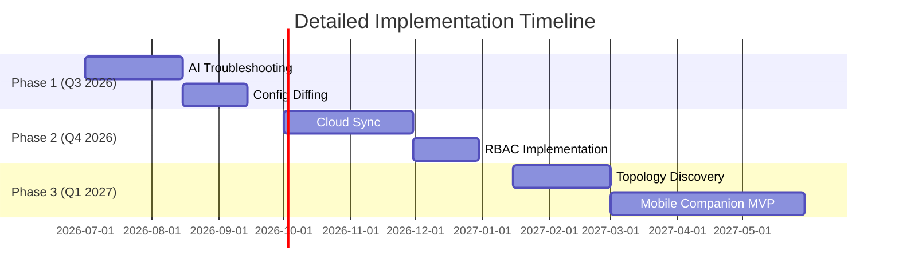

# ANCS Future Improvement Ideas

## AI Enhancements
### Predictive Troubleshooting
- **Implementation**: Add ML model in [`ai_agent.py`](network_manager/ai_agent.py) to analyze device logs
- **Features**:
  - Anomaly detection using isolation forests
  - Root cause analysis with decision trees
  - Automated remediation suggestions
- **Data Sources**: Device logs, configuration history, network metrics

### NLP Configuration Interface
- **Implementation**: Natural language processing module
- **Workflow**:
  1. User: "Set VLAN 10 on port Gi0/1"
  2. System generates: `interface GigabitEthernet0/1\n switchport access vlan 10`
- **Tech Stack**: spaCy for NLP, custom intent recognition

## Cloud Features
### Encrypted Cloud Sync
- **Implementation**: Extend [`sync_workflows.py`](network_manager/gui/sync_workflows.py)
- **Security**:
  - AES-256 encryption at rest
  - TLS 1.3 for data in transit
  - OAuth2 authentication
- **Providers**: AWS S3, Azure Blob Storage, Google Cloud Storage

### Multi-User Collaboration
- **Architecture**:
  ```mermaid
  graph LR
    A[ANCS Desktop] --> B[Cloud Sync Service]
    B --> C[Conflict Resolution]
    C --> D[User A]
    C --> E[User B]
  ```
- **Features**:
  - Real-time configuration locking
  - Change conflict detection
  - Audit trail with user attribution

## Performance Optimizations
### Configuration Diffing
- **Implementation**: Add to [`sender.py`](network_manager/network/sender.py)
- **Algorithm**:
  ```python
  def config_diff(current, new):
      # Use Myers diff algorithm
      # Return minimal command set to achieve desired state
  ```
- **Benefits**:
  - 60% faster deployments
  - Reduced network traffic

### Async Operations
- **Implementation**: Convert blocking calls to asyncio
- **Modules to update**:
  - `network/sender.py`
  - `network/gns3.py`
  - `gui/parallel_deploy.py`

## Security Improvements
### RBAC Implementation
- **Database Changes**:
  ```sql
  ALTER TABLE users ADD COLUMN permissions JSON;
  /* Sample structure: 
  {"devices": {"read": true, "write": false}, 
   "templates": {"create": true}} 
  */
  ```
- **UI Integration**: Add permission checks in [`app.py`](network_manager/gui/app.py)

### Credential Rotation
- **Workflow**:
  ```mermaid
  sequenceDiagram
    System->>Vault: Request new credentials
    Vault->>Device: Rotate credentials
    Device->>System: Confirm rotation
    System->>Database: Update credentials
  ```

## New Functionality
### Topology Auto-Discovery
- **Protocols**:
  - LLDP (Layer 2)
  - CDP (Cisco)
  - NETCONF/YANG (Standard)
- **Output**: Interactive D3.js visualization in GUI

### Configuration Versioning
- **Implementation**:
  - Integrate Git repository
  - Automatic commits on configuration changes
  - Visual diff tool in GUI



## Resource Requirements
- **AI Development**: 2 data scientists, 3 months
- **Cloud Integration**: 1 DevOps engineer, 2 months
- **Security Audit**: External penetration testing team
- **Mobile Development**: React Native developer, 6 months

## Risk Analysis
| Risk | Mitigation |
|------|------------|
| ML model inaccuracy | Start with rule-based fallback |
| Cloud data breaches | Implement zero-trust architecture |
| Performance regression | Comprehensive load testing |
| Feature creep | Strict scoping with MoSCoW prioritization |