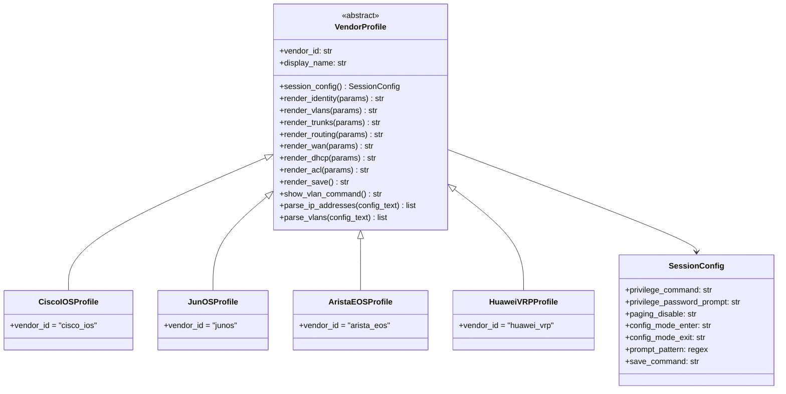

# Multi-Vendor Support for ANCS

## Current State

Cisco IOS CLI is hardcoded in six areas:

- **Config generation** — `guided_setup_wizard.py` (~770 lines of `_render_*_block` methods emit raw IOS)
- **Session handling** — `sender.py` assumes `enable`, `terminal length 0`, `configure terminal`, `>` / `#` prompts
- **AI Copilot** — `ai_agent.py` system prompt says "Cisco", `generate_device_config` emits IOS, session pool uses IOS prompts
- **Validators** — `validators.py` regex-matches `ip address`, `vlan`, `interface Vlan` (IOS syntax)
- **GNS3 classification** — `app.py` uses Cisco model strings (`c7200`, `c3725`, `adventerprisek9`) to detect routers/switches
- **Device models** — `models/devices.py` are already vendor-agnostic (just named template dicts)

## Architecture: Vendor Profile System

The core idea is a **`VendorProfile`** — a pluggable object that encapsulates everything vendor-specific. Each NOS gets one profile. All existing Cisco logic moves into a `CiscoIOSProfile`.



## File Structure

New package: `network_manager/vendors/`

```
network_manager/vendors/
    __init__.py          # VENDOR_REGISTRY dict, get_profile(vendor_id), detect_vendor(gns3_node)
    base.py              # VendorProfile ABC + SessionConfig dataclass
    cisco_ios.py         # CiscoIOSProfile — extract existing IOS logic here
    junos.py             # JunOSProfile (Phase 2)
    arista_eos.py        # AristaEOSProfile (Phase 2)
    huawei_vrp.py        # HuaweiVRPProfile (Phase 3)
    mikrotik.py          # MikroTikProfile (Phase 3)
```

## Phased Implementation

### Phase 1 — Abstraction layer + Cisco extraction (no new vendors yet)

Goal: Refactor without breaking anything. All current behavior stays identical, but routed through the profile system.

**1a. Create `vendors/base.py`** — define `VendorProfile` ABC with:
- `SessionConfig` dataclass (privilege cmd, paging disable, prompt regex, config mode enter/exit, save cmd)
- Abstract render methods matching existing `_render_*_block` signatures
- Abstract parse methods for validators (`parse_ip_addresses`, `parse_vlans`, `parse_l3_interfaces`)
- `detect_from_gns3(node_info) -> bool` class method for auto-detection

**1b. Create `vendors/cisco_ios.py`** — `CiscoIOSProfile(VendorProfile)`:
- Move all `_render_*_block` logic from `guided_setup_wizard.py` into profile methods
- Move session constants from `sender.py` (enable, terminal length 0, `>/#` prompt regex)
- Move GNS3 classification keywords from `app.py` (`c7200`, `c3725`, `adventerprisek9`, etc.)
- Move IOS regex patterns from `validators.py`

**1c. Create `vendors/__init__.py`** — registry:
- `VENDOR_REGISTRY: dict[str, type[VendorProfile]]`
- `get_profile(vendor_id: str) -> VendorProfile`
- `detect_vendor(gns3_node: dict) -> VendorProfile` — iterate registry, call each `detect_from_gns3()`
- Default fallback: `CiscoIOSProfile`

**1d. Wire profile into existing code:**
- **`models/devices.py`**: Add `vendor_id: str = "cisco_ios"` field to `DeviceModel`; persist in DB via new column in [config.py](network_manager/config.py)
- **`guided_setup_wizard.py`**: Constructor receives `vendor_profile`; `_render_*` methods delegate to `profile.render_*(params)` instead of inline IOS strings
- **`sender.py`**: `send_telnet` / `send_ssh` accept a `SessionConfig` param; use it for privilege, paging, prompt detection, config mode
- **`validators.py`**: Call `profile.parse_ip_addresses()` / `profile.parse_vlans()` instead of hardcoded regex
- **`app.py`**: GNS3 import calls `detect_vendor()` to set `vendor_id` on the device; pass profile to wizard
- **`ai_agent.py`**: `generate_device_config` looks up device vendor, delegates to profile; system prompt mentions supported vendors; Copilot session uses `SessionConfig` for pool connections

### Phase 2 — First new vendors (Juniper JunOS + Arista EOS)

These are the most common non-Cisco GNS3 images and closest in lab popularity.

**JunOS** — `vendors/junos.py`:
- Session: `cli`, no enable; paging: `set cli screen-length 0`; config: `configure`/`commit`/`exit`; prompt: `> ` / `# ` / `%`
- Config style: hierarchical `set` commands (e.g. `set interfaces ge-0/0/0 unit 0 family inet address ...`)
- GNS3 detection: `vsrx`, `vmx`, `vqfx`, `junos`, `juniper`
- Render methods produce JunOS `set` syntax for VLANs, routing, firewall filters, etc.

**Arista EOS** — `vendors/arista_eos.py`:
- Session: Very similar to IOS (enable, `terminal length 0`, `configure terminal`) — can subclass `CiscoIOSProfile` and override differences
- Key differences: `vlan` config is global (no `vlan database`), `ip routing` enabled differently, `write memory` vs `copy running-config startup-config`
- GNS3 detection: `veos`, `arista`, `ceos`

### Phase 3 — Additional vendors

**Huawei VRP** — `vendors/huawei_vrp.py`:
- Session: `system-view` instead of `configure terminal`; `screen-length 0 temporary`; `return`/`quit`; prompt `<hostname>` / `[hostname]`
- Config: `interface GigabitEthernet0/0/0`, `ip address`, `vlan batch`, `port link-type trunk`

**MikroTik RouterOS** — `vendors/mikrotik.py`:
- Session: No enable; `/` commands; no "config mode"
- Config: `/interface bridge add`, `/ip address add`, `/routing ospf instance`
- Very different paradigm — flat command paths

### Phase 4 — UI and Copilot polish

- **Vendor selector in UI**: When importing from GNS3, show detected vendor per device with override dropdown
- **Wizard adapts per vendor**: Step labels, help text, and field names adjust (e.g. "Access List" vs "Firewall Filter" for JunOS)
- **Copilot system prompt**: Dynamically includes vendor-specific grounding per device
- **Topology viewer**: Vendor icons/colors per node

## Key Design Decisions

- **Strategy pattern over templates**: Vendor profiles are Python classes with methods, not Jinja templates. This keeps type safety, lets you do conditional logic per feature, and matches the existing code style.
- **Cisco stays the default**: `detect_vendor()` falls back to `CiscoIOSProfile` so nothing breaks for existing users or unrecognized images.
- **Vendor stored per device, not globally**: Different devices in the same project can be different vendors (realistic — mixed-vendor labs).
- **Incremental delivery**: Phase 1 is pure refactor with zero behavior change. Each subsequent phase adds one vendor file without touching the core framework.

## DB Migration

One new column in [config.py](network_manager/config.py):

```python
_add_column_if_not_exists("devices", "vendor_id", "TEXT DEFAULT 'cisco_ios'")
```

Existing devices automatically get `cisco_ios` — backward compatible.
